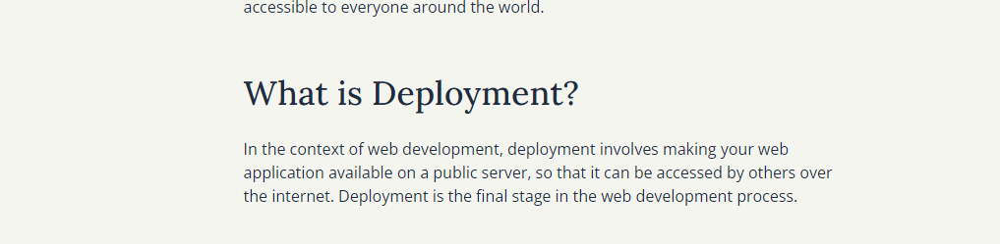

<h1 align="center">MoviWeb App</h1>

The MoviWeb App allows users to pick their identity and then view, add, update, or delete movies from their personalized favorite movie list.

### 🏠 [Homepage](https://github.com/nagrapoonam/moviweb_app)

### ✨ [Demo](https://movie-app95.herokuapp.com/)

## Bult with

* [Flask]() - Microframework
* OMDBapi - Api for Movie
* HTML - Markup Language
* CSS & Bootstrap -  UI & Styling
* Js & Jquery - More interactive & functionality

###  A movie watchlist application.

### Description
A watch-list app built with Flask using the TMDB API with CRUD and user authentication. The application makes use of the movie database API (tmdb).

### Features
Here are the features in summary:
* App displays popular movies, upcoming movies and latest movies
* User can search and review any movie.

## Technologies Used
* Python 3.7.4
* Flask 1.1.1
* HTML  
* CSS
* PostgreSQL
* Bootstrap 3.3.7
